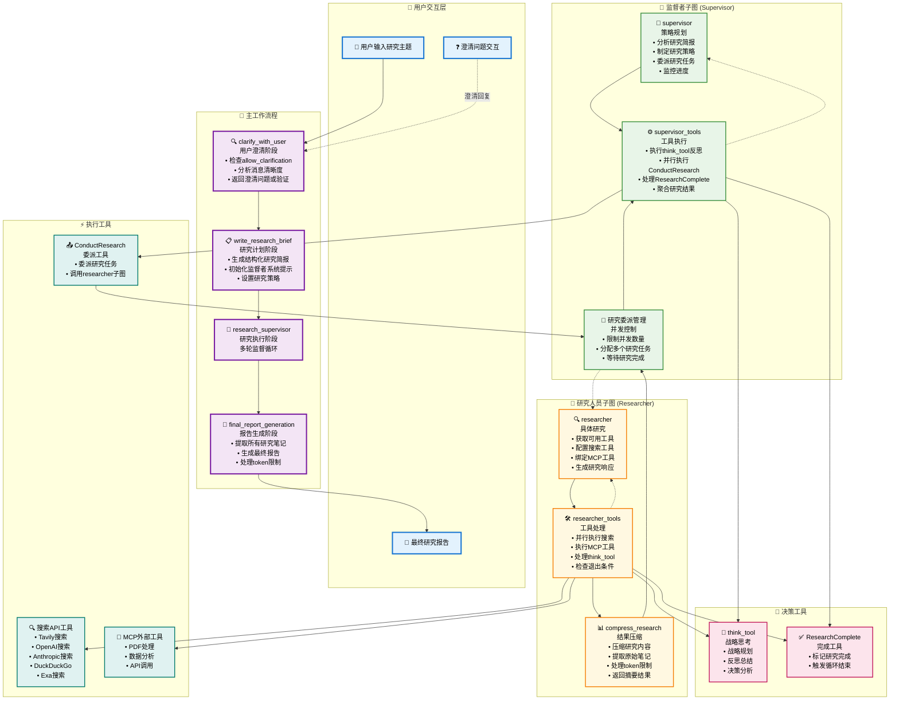

# Open Deep Research 完整工作流程图

## 详细工作流程图

## 关键工作流程说明

### 🔍 澄清阶段 (clarify_with_user)

- **输入**: 用户原始研究主题
- **处理**: 检查配置、调用AI分析消息清晰度
- **输出**: 澄清问题或验证消息，进入研究计划阶段

### 📋 研究计划阶段 (write_research_brief)

- **输入**: 澄清后的用户消息
- **处理**: 生成结构化研究简报、初始化监督者
- **输出**: 研究简报、supervisor_messages，进入监督者阶段

### 🔄 监督者循环 (Supervisor Loop)

1. **supervisor**: 分析上下文、生成工具调用
2. **supervisor_tools**: 执行工具调用、检查退出条件
3. **循环继续**: 直到满足结束条件或委派研究任务

### 🔬 研究人员循环 (Researcher Loop)

1. **researcher**: 配置工具、生成研究响应
2. **researcher_tools**: 执行搜索和处理、检查退出条件
3. **compress_research**: 压缩结果、返回监督者

### 📄 报告生成阶段 (final_report_generation)

- **输入**: 所有研究笔记和发现
- **处理**: 配置报告模型、生成综合报告
- **输出**: 最终研究报告

## 核心机制详解

### 并发执行机制

- **监督者**: 支持多个研究任务并行执行
- **并发限制**: 通过 `max_concurrent_research_units` 配置
- **结果聚合**: 所有研究结果汇总后返回监督者

### 错误处理机制

- **Token限制**: 自动检测、截断重试、渐进式减少
- **工具失败**: 安全包装、错误消息记录
- **重试逻辑**: 结构化输出和API调用的自动重试

### 循环退出条件

- **监督者循环**:
    - 达到最大迭代次数
    - 没有工具调用
    - 显式调用ResearchComplete
- **研究人员循环**:
    - 早期退出: 无工具调用
    - 晚期退出: 达到工具调用限制或显式完成
